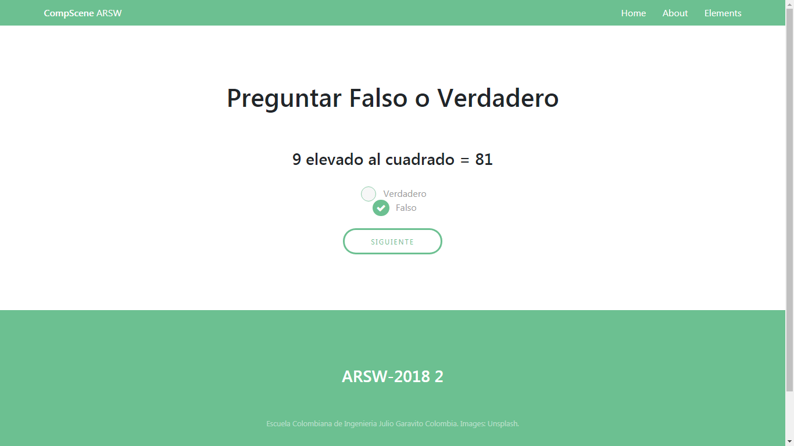

# CompScene

## Arquitecturas de Software (ARSW) 
## 2018-2 
## Escuela Colombiana de Ingeniería Julio Garavito - Ingeniería de Sistemas
#### Juego educativo, competitivo y a su vez de entretenimiento tipo trivia que pretende poner a prueba los conocimientos que los usuarios tengan sobre: matemáticas,  programación o lógica calculativa, mediante tres tipos de pregunta en tiempo real.
---
### Integrantes
- Daniel E. Beltrán Franco
- Daniel E. Castiblanco Rocha
- Cesar E. Lanos Camacho
### Profesor
- Luis Daniel Benavides Navarro
---
### :link: URLs
| Elemento | Link |
|:-------------------------------------:|:----------------------------------------------------------------------------------------------------:|
| Propuesta de proyecto | https://docs.google.com/document/d/1K1JDaow5Tx50JQjSpznRKCyIFm_KJOQI2qhBrM3IMqQ/edit?usp=sharing |
| Trello | https://trello.com/b/jBTv83Tq/arsw-2018-2-historias-compscene |
| NinjaMock | https://ninjamock.com/s/JKFVVTx |
| Backlog de producto | https://docs.google.com/spreadsheets/d/1KDiZdkcWTnHBWtftqC7oe6yVvaTo-bsEyzWVGUkCb-4/edit?usp=sharing |
| Javadoc | Generado en la ruta ./target/site/apidocs |
| Documento de Arquitectura del Sistema | https://drive.google.com/open?id=1v80f1kmaeB-Irwnzg7KMCXpx6v5byPgE7osgPUxiw1Y |
---
### :book: Instrucciones
Cada pregunta consta de un tiempo límite para contestarla, cuando el jugador conteste dicha pregunta deberá esperar a que se acabe ese tiempo límite para proceder a la siguiente y para visualizar si su respuesta fue o no correcta, sin embargo internamente se sabrá en cuanto tiempo la respondió y eso será un factor importante a la hora de calcular el puntaje entre los competidores.

---

### :camera: Pantallas de la aplicación

---

---

---

---

---

### :triangular_ruler: Diseño de arquitectura 
#### - Paquetes

#### - Clases

#### - Despliegue

#### - Secuencia

#### - Casos de uso

---
### :wrench: Tecnologías utilizadas

---
### Licencia
[MIT](https://github.com/DanBeltF/2018-2-ARSW-CompScene/blob/master/LICENSE)
